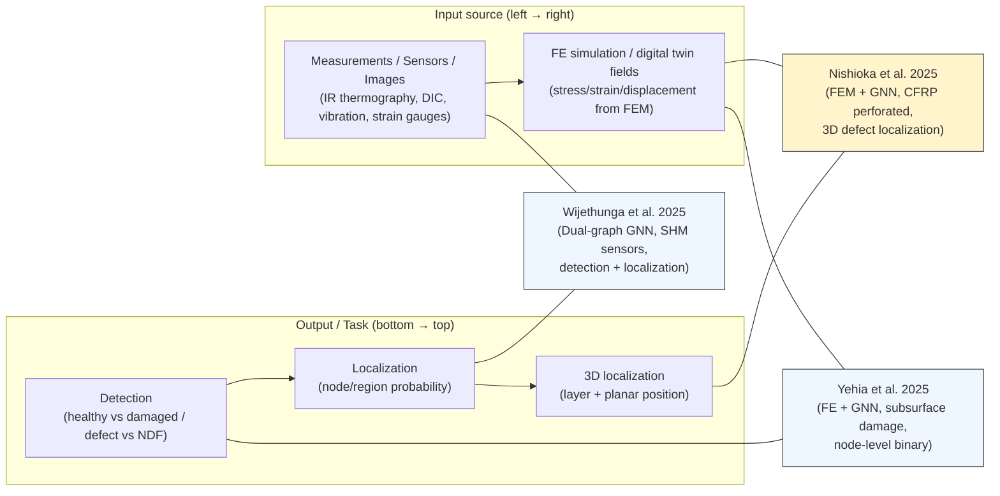

# Positioning diagram (for paper/slides)

目的: 「どの文脈の研究を参照しているか」を1枚で説明する。

## Diagram (Mermaid)

## How to use
- slides: この1枚を「Related Work / Positioning」に置く
- paper: Related Work末尾に小図として挿入し、本文で「YehiaはFE×GNNでsubsurface（二値）」「Wijethungaはsensor-graph SHM（dual-graph）」と対比する

